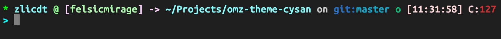

# Oh My Zsh theme - cysan
Modified by zlicdt in 2026 from `ys`.


Just download this cysan.zsh-theme file and place it to `~/.oh-my-zsh/custom/themes/`

You can run ->
```bash
curl -L -o "${ZSH_CUSTOM:-$HOME/.oh-my-zsh/custom}/themes/cysan.zsh-theme" https://github.com/zlicdt/omz-theme-cysan/raw/refs/heads/master/cysan.zsh-theme
```

And change `ZSH_THEME` in `~/.zshrc` to "cysan".